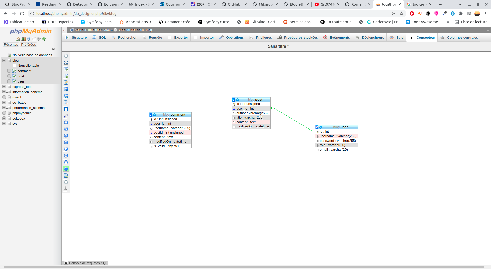

# PHP blog with MVC architecture
This site was created for a PHP / Symfony developer training project OpenClassrooms

## Requirement

### __Server__
You need a web server with PHP7 and MySQL DBMS.  
Versions used in this project:
* Apache 2.4.46
* PHP ≥ 7.4
* MySQL 5.7.31

### __Languages and libraries__
This project is coded in __PHP7__, __HTML5__, __CSS3__ and __JS__.  
Dependencies manager: __Composer__  
PHP packages, included via Composer:
* Symfony/Dotenv ^5.2 ([more info](https://github.com/symfony/dotenv)) 
* "guzzlehttp/psr7": "^1.8",
* "http-interop/response-sender": "^1.0",
* PHPMailer  
  
  CSS/JS libraries, included via CDN links:
* Bootstrap 3.3.7
* Font-awesome ^5.15.1
* "twig/twig": "^3.0",

_NB: If you want to customize Bootstrap, install it in your project instead of using CDN links ([more info](https://getbootstrap.com/))._

---
## Installation

### __Download__
Download zip files or clone the project repository with github ([see GitHub documentation](https://docs.github.com/en/github/creating-cloning-and-archiving-repositories/cloning-a-repository)).

### __Configure environment variables__
1.  Open the ___.env.example___ file
2.  Replace the example values with your own values (Database, SMTP, and default Admin info)
3.  Rename the file ___.env___
```env
# .env
DB_HOST=host_name
DB_NAME=db_name
DB_CHARSET=utf8
DB_USERNAME=username
DB_PASSWORD=password
SMTP_HOST=host
SMTP_USERNAME=username
SMTP_PASSWORD=password
ADMIN_EMAIL=your@email.com
ADMIN_NAME=yourname
```
### __Create the database__
1.  Create a new MySQL Database in your DBMS
2.  Import ___blog.sql___ file

#### ___DB schema___


* Clone :
```bash
git clone https://github.com/MikaidouMB/BlogProject.git
```
---  
### __Install Composer__
1.  Install __Composer__ by following [the official instructions].(https://getcomposer.org/download/).
2.  Go to the project directory in your cmd:
```
$ cd some\directory
```
3.  Install dependencies with the following command:
```
$ composer install
```
Dependencies should be installed in your project (check _vendor_ directory).

---
## USAGE

### __Visit your new site__
Open ___public/index.php___ file in your favorite browser. This is your home page!

#### __Public URLs list you can open in your browser:__
Authors have to be connected and approved to access to their back-office pages.
| Context | Page | URL from '_/public/index.php_' | Allowed users |
|:--------------:|:-------------|:--------------|--------------:|
| front | Home | - | All |
| front | Articles | ?route=posts | All |
| front | Article #ID | ?route=post&id=ID | All |
| front | Inscription | ?route=signUp | All |
| front | Connection | ?route=login | All |
| viewer| Manage his articles | ?route=adminPostViewers| Posts author |
| admin | Manage the articles | ?route=adminPostList | Posts author, Admin |
| admin | Add article | ?route=addPost | Authors, Admin |
| admin | Edit article #ID | ?route=editAdminPost&id=ID | Post author, Admin |
| admin | Manage comments | ?route=adminPostcomments | Posts author, Admin |
| admin | Manage comments of post #ID | ?route=editComment&id=ID | Post author, Admin |
| admin | Manage users | ?route=adminPostUsers | Admin |
| admin | Edit user #ID | ?route=editUser&id=ID | Author #ID, Admin |

### __Create your admin profile__
1.  Register you as a new user via registration form (___public/index.php?route=signUp___)
2.  Update your user profile in the database to set role to "admin"):

3.  Connect to the admin (___public/index.php?route=login___) to check that you are administrator.
4.  Start managing your site!

## Vendor
* [Twig](https://twig.symfony.com/doc/2.x/tags/if.html)
* [Font Awesome](https://fontawesome.com/)

## Améliorations possibles
* Rewrite rules on htaccess
* Account management
* Home page management
